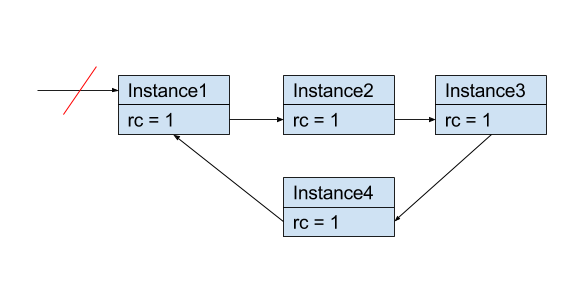
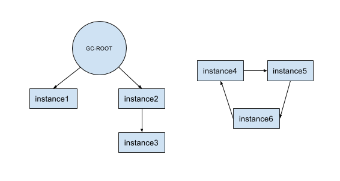
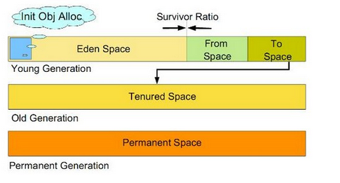

# **垃圾回收器**
- Author：WeicongLee
- Data：2019.05.08

## **GC**
Java为我们提供了GC（垃圾回收）机制，这使得我们在app运行过程中能够创建许多对象而不容易触发OOM（内存溢出）。它能够销毁内存中不再使用的对象，从而为其他对象腾出空间。

## **栈与堆的垃圾回收**
- 由于栈内存是JVM自动管理的，栈的内存都是随着函数的开始执行和结束自动分配、释放的。
- GC（垃圾回收器）的工作是对堆进行垃圾回收。

## **判断对象是否可回收**
- #### **引用计数算法**
   - 给每个对象添加一个引用计数器，每有一个对象引用它了，就+1，失效时就-1。当计数器为0的对象就是不再使用的，GC就会对其进行回收。
   - 该方法虽然方便，但是它很难解决存在对象相互循环引用的情况，如图，instance1已经断开了外部引用，但它计数器仍然不为0，那么以下的对象就无法被回收了。
   

- #### **根搜索算法**
    这个方法利用了有向图的概念，若不能从GC-Root到达对象就为可回收的对象，只要GC-Root不可到达即视为可回收，这样就可有效解决对象相互循环引用的问题了。Java的垃圾回收器采用的就是该方法。
    

## **内存中堆的分代**
JVM将堆分成了二大区新生代（Young）和老年代（Old），新生代又进一步划分为Eden和Survivor区，而Survivor由FromSpace和ToSpace组成，也可以称为Survivor1和Survivor2（下称S1、S2）。

### **1）新生代**
新创建的对象都是用新生代分配内存，Eden空间不足时，触发Minor GC，这时会把存活的对象转移进Survivor区，回收算法采用**复制法**，并且：
- Eden：S1：S2 = 8：1：1
- 新new一个对象时，这个对象会分配到Eden
- 当Eden满了的时候，引用可达的对象就会进入S1（FromSpace），然后清空Eden
- 当S1也满了以后，将Survivor1中引用可达的对象移入S2，清空S1。当两个存活区切换了几次后，仍然存活的对象将复制到老年代

### **2）老年代**
老年代用于存放经过多次Minor GC之后依然存活的对象。老年代的空间会比新生代大，GC发生的次数也比新生代少。回收算法采用**标记整理法**。

### **3）永久代**
包含应用的类/方法信息，以及JRE库的类和方法信息。

## **垃圾收集算法**
### **1）标记清除法（Mark-Sweep）**
- 分为两个阶段：**标记阶段和清除阶段**。标记阶段的任务是**标记出所有存活的对象**，清除阶段就是**回收未被标记的对象**所占用的空间。
- 该算法容易产生内存碎片，碎片太多可能会导致后续过程中需要为大对象分配空间时无法找到足够的空间而提前触发新的一次垃圾收集动作。
   - 标记：标记出存活的对象
   - 清除：回收未被标记的对象
   - 优点：简单，易实现
   - 缺点：容易产生内存碎片，适用于小对象

### **2）复制算法（Copying）**
- 把内存区域分为容量相等的两块区域，每次只使用其中一块，当一块内存空间用完了，就把存活的对象复制到另一块中，然后把刚使用过的内存空间一次清除。
- 此算法虽然简单，但对内存空间的使用做出了高昂的代价，因为能够使用的内存缩减到原来的一半。
   - 优点：简单，不会产生内存碎片
   - 缺点：空间使用率低，当存活对象多时，效率会降低

### **3）标记整理算法（Mrak-Compact）**
- 与标记清除（Mark-Sweep）同样分为两个阶段：标记阶段和整理阶段。不同的是该算法是将被标记的存活对象向一端移动，最后再把端边界以外的内存清除掉。
- 一般厂商JVM中老年代GC就是使用这种算法，由于老年代的特点是每次回收都只回收少量对象。

## **Stop-The-World**
GC对于内存的管理来说是十分有好处的，但是在GC的过程中会暂停主线程的工作（该情况即称为STW）。我们直到，Android所有UI的刷新都是在主线程上的，如果GC的时间过长，或者频繁进行GC（内存抖动），就会 导致UI的刷新过程卡顿，这种卡顿超过16ms就会让用户觉得界面出现卡顿。